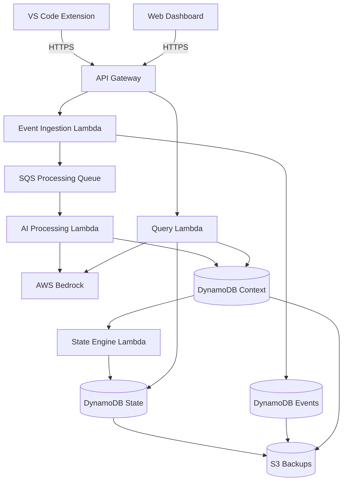

# Design Document: FlowSync

## Overview

FlowSync is an AI-powered development intelligence system that transforms raw coding activity into structured project context. The system consists of five major subsystems:

1. **VS Code Extension** - Client-side event capture
2. **Event Ingestion Backend** - Reliable event reception and storage
3. **AI Processing Layer** - Context extraction and analysis
4. **Project State Engine** - State management and consistency
5. **Dashboard & Query Interface** - Visualization and interaction

The architecture emphasizes determinism, traceability, and structured reasoning. All processing is reproducible, all state changes are auditable, and all insights are traceable to source events.

### Design Principles

- **Determinism**: Identical inputs with identical model versions produce identical outputs
- **Traceability**: Every piece of derived data links back to source events
- **Event Sourcing**: State is derived from immutable event streams
- **Separation of Concerns**: Clear boundaries between capture, storage, processing, and presentation
- **Eventual Consistency**: Components can operate independently with eventual synchronization

## MVP Implementation Scope

### Hackathon Prototype Scope

The initial prototype will implement core functionality to demonstrate the FlowSync concept:

**Included in Prototype**:
- Project creation and basic metadata management
- Feature proposal and approval workflow (manual approval only)
- VS Code extension for commit event capture (commits only, not file saves or notes)
- Event ingestion backend with validation and storage
- AI processing layer for commit analysis (intent and entity extraction)
- Basic project state engine (event storage and feature association)
- Simple dashboard showing projects, features, and event timeline
- Basic query interface for feature status and recent changes

**Simplified for Prototype**:
- Single AWS region deployment (us-east-1 only)
- Manual scaling (no auto-scaling configuration)
- Basic authentication (API tokens only, no OAuth)
- Single role (all users have developer permissions)
- Synchronous processing (no SQS queues, direct Lambda invocation)
- In-memory feature association (no complex keyword matching)

**Future Architecture / Planned Enhancements**:
- Multi-region deployment with failover
- Auto-scaling for Lambda and DynamoDB
- OAuth authentication and fine-grained RBAC
- Real-time WebSocket updates for dashboard
- Advanced query interface with natural language understanding
- File change and developer note capture
- Relationship detection between files
- Code change heatmaps and contribution metrics
- Comprehensive audit logging and compliance features
- Data export and backup automation
- Performance optimization for large projects (>10,000 events)
- Circuit breakers and advanced error handling
- Chaos engineering and fault injection testing

### Prototype Architecture Simplifications

The prototype uses a simplified architecture:
- Direct API Gateway → Lambda → DynamoDB flow (no queues)
- Bedrock calls made synchronously during event ingestion
- Feature association uses simple keyword matching without confidence scoring
- Dashboard polls for updates (no WebSocket)
- Single DynamoDB table for events (no separate context table)
- Minimal error handling (basic retries only)

## Practical Constraints for Prototype

### Design Philosophy

FlowSync is designed for small teams (5-50 developers) with emphasis on correctness over scale. The prototype prioritizes:

**Correctness First**:
- Deterministic processing with full traceability
- Data integrity and consistency guarantees
- Comprehensive validation and error handling
- Property-based testing for core invariants

**Simplicity Over Scale**:
- Single-region deployment sufficient for small teams
- Synchronous processing acceptable for prototype load
- Manual scaling adequate for initial usage
- Direct Lambda invocations instead of complex queuing

**Prototype Limitations**:
- Designed for up to 50 concurrent developers
- Tested with projects up to 10,000 events
- Single AWS region (no geographic distribution)
- Basic fault tolerance (retries, but no circuit breakers)
- Manual backup procedures (no automated disaster recovery)

**Future Scaling Path**:
When team size or project complexity grows beyond prototype constraints:
- Add SQS queues for asynchronous processing
- Enable DynamoDB auto-scaling and global tables
- Implement multi-region deployment with failover
- Add advanced monitoring and alerting
- Implement circuit breakers and bulkheads
- Optimize for projects with >100,000 events

### Prototype vs Production

| Aspect | Prototype | Production (Future) |
|--------|-----------|---------------------|
| Regions | Single (us-east-1) | Multi-region with failover |
| Scaling | Manual | Auto-scaling |
| Processing | Synchronous | Asynchronous with queues |
| Auth | API tokens | OAuth + RBAC |
| Monitoring | Basic CloudWatch | Full observability stack |
| Backups | Manual | Automated with retention |
| Load | 50 developers | 500+ developers |
| Events | 10K per project | 1M+ per project |

## Architecture

### High-Level Architecture



### Component Responsibilities

**VS Code Extension**
- Capture development events (commits, file changes, notes)
- Queue events locally during network outages
- Retry failed transmissions with exponential backoff
- Authenticate with backend using API tokens

**Event Ingestion Backend**
- Validate incoming event schemas
- Assign unique identifiers to events
- Persist events to DynamoDB with timestamp ordering
- Enqueue events for AI processing
- Respond within 500ms SLA

**AI Processing Layer**
- Extract structured context from events
- Identify code entities (functions, classes, modules)
- Infer intent from commit messages and diffs
- Detect file relationships
- Extract concepts from developer notes
- Produce deterministic outputs

**Project State Engine**
- Maintain current project and feature state
- Associate events with features
- Update progress indicators
- Ensure atomic state transitions
- Provide fast state queries (<200ms)

**Dashboard & Query Interface**
- Visualize project intelligence
- Display timelines and heatmaps
- Answer natural language queries
- Cite sources for all information
- Update in real-time as events are processed

**Note**: Target performance values are design goals; prototype performance may vary.

### Data Flow

1. Developer activity triggers event in VS Code Extension
2. Extension captures event details and transmits to API Gateway
3. API Gateway authenticates request and routes to Ingestion Lambda
4. Ingestion Lambda validates, persists to DynamoDB, and enqueues for processing
5. AI Processing Lambda dequeues event, calls Bedrock, extracts context
6. Extracted context is persisted with source event reference
7. State Engine Lambda updates project/feature state based on new context
8. Dashboard queries state and context stores to display intelligence
9. Query Interface uses context + Bedrock to answer user questions

## Components and Interfaces

### VS Code Extension

**Technology**: TypeScript, VS Code Extension API

**Key Modules**:
- `EventCapture`: Monitors VS Code events and creates event objects
- `EventQueue`: Local persistent queue for offline operation
- `APIClient`: HTTP client with retry logic and authentication
- `ConfigManager`: Manages project ID and API token configuration

**Event Capture Logic**:
```typescript
interface CapturedEvent {
  eventId: string;          // UUID generated client-side
  projectId: string;        // Configured project identifier
  eventType: 'commit' | 'file_change' | 'developer_note';
  timestamp: string;        // ISO 8601 UTC
  payload: CommitPayload | FileChangePayload | NotePayload;
}

interface CommitPayload {
  commitHash: string;
  message: string;
  author: string;
  changedFiles: string[];
}

interface FileChangePayload {
  filePath: string;
  changeType: 'created' | 'modified' | 'deleted';
}

interface NotePayload {
  text: string;
  filePath: string;
  lineNumber: number;
}
```

**Retry Strategy**:
- Initial retry after 1 second
- Exponential backoff: 2s, 4s, 8s
- Maximum 3 retry attempts
- Failed events remain in local queue for manual inspection

**Configuration**:
- Project ID stored in `.vscode/flowsync.json`
- API token stored in VS Code secure storage
- Backend URL configurable (default: production endpoint)

### Event Ingestion Backend

**Technology**: AWS Lambda (Node.js), API Gateway, DynamoDB

**API Endpoints**:

```
POST /api/v1/events
Authorization: Bearer <token>
Content-Type: application/json

Request Body:
{
  "eventId": "uuid",
  "projectId": "string",
  "eventType": "commit" | "file_change" | "developer_note",
  "timestamp": "ISO 8601",
  "payload": { ... }
}

Response (200 OK):
{
  "eventId": "uuid",
  "status": "accepted",
  "receivedAt": "ISO 8601"
}

Response (400 Bad Request):
{
  "error": "validation_failed",
  "details": ["field: reason", ...]
}

Response (401 Unauthorized):
{
  "error": "invalid_token"
}
```

**Validation Rules**:
- `eventId` must be valid UUID
- `projectId` must exist and user must have access
- `eventType` must be one of allowed values
- `timestamp` must be valid ISO 8601 UTC
- `payload` must match schema for event type
- `commitHash` must be valid Git SHA (40 hex chars)
- `filePath` must be relative path without `..` traversal

**DynamoDB Schema (Events Table)**:
```
Table: flowsync-events
Partition Key: projectId (String)
Sort Key: timestamp#eventId (String)

Attributes:
- projectId: String
- eventId: String (UUID)
- timestamp: String (ISO 8601)
- eventType: String
- payload: Map
- receivedAt: String (ISO 8601)
- processedAt: String (ISO 8601, optional)
- processingStatus: String (pending | processing | completed | failed)

GSI: EventIdIndex
- Partition Key: eventId
- For direct event lookup

GSI: ProcessingStatusIndex
- Partition Key: processingStatus
- Sort Key: receivedAt
- For processing queue management
```

**Lambda Handler Logic**:
1. Parse and validate request body
2. Verify JWT token and extract user identity
3. Check user authorization for project
4. Validate event schema
5. Write to DynamoDB with `processingStatus: pending`
6. Send message to SQS processing queue
7. Return success response

### AI Processing Layer

**Technology**: AWS Lambda (Python), AWS Bedrock (Claude), DynamoDB

**Processing Pipeline**:
1. Receive event from SQS queue
2. Retrieve full event details from DynamoDB
3. Construct prompt for Bedrock based on event type
4. Call Bedrock with deterministic parameters
5. Parse structured response
6. Persist extracted context to DynamoDB
7. Update event `processingStatus` to `completed`
8. Trigger State Engine update

**Bedrock Configuration for Determinism**:
```python
bedrock_params = {
    "modelId": "anthropic.claude-3-sonnet-20240229",
    "temperature": 0.0,  # Deterministic
    "top_p": 1.0,
    "max_tokens": 2000
}
```

**Determinism Guarantees**:
- Determinism is guaranteed only per model version
- The model version (modelId) is stored with each structured context output
- Identical inputs + identical model version = identical outputs
- Model version changes may produce different outputs for the same input
- All context records include `modelVersion` field for traceability
- When model versions change, historical outputs remain valid and traceable to their model version

**Prompt Templates**:

For commit events:
```
Analyze this Git commit and extract structured context.

Commit Hash: {commitHash}
Commit Message: {message}
Author: {author}
Changed Files: {changedFiles}
Diff: {diff}

Extract the following in JSON format:
{
  "intent": "Brief description of what this commit accomplishes",
  "changedEntities": [
    {
      "type": "function" | "class" | "module" | "file",
      "name": "entity name",
      "action": "created" | "modified" | "deleted"
    }
  ],
  "concepts": ["key concept 1", "key concept 2"],
  "relatedFeatures": ["feature keyword 1", "feature keyword 2"]
}

Be precise and deterministic. Extract only factual information from the code.
```

For developer notes:
```
Analyze this developer note and extract key information.

Note: {text}
File: {filePath}
Line: {lineNumber}

Extract the following in JSON format:
{
  "noteType": "decision" | "todo" | "question" | "explanation",
  "concepts": ["concept 1", "concept 2"],
  "actionItems": ["action 1", "action 2"],
  "relatedCode": ["entity 1", "entity 2"]
}

Be precise and deterministic.
```

**DynamoDB Schema (Context Table)**:
```
Table: flowsync-context
Partition Key: eventId (String)
Sort Key: contextType (String)

Attributes:
- eventId: String (UUID, references event)
- projectId: String
- contextType: String (intent | entities | concepts | relationships)
- extractedAt: String (ISO 8601)
- content: Map (structured context data)
- modelVersion: String (Bedrock model ID)
- processingDuration: Number (milliseconds)

GSI: ProjectContextIndex
- Partition Key: projectId
- Sort Key: extractedAt
- For project-wide context queries
```

**Error Handling**:
- Bedrock API failures: Retry with exponential backoff (3 attempts)
- Parsing failures: Log error, mark event as `failed`, alert monitoring
- Timeout: Lambda timeout set to 30 seconds, event returns to queue

### Project State Engine

**Technology**: AWS Lambda (Python), DynamoDB

**State Management**:

The State Engine maintains derived state from events and context. It processes updates triggered by new context extraction.

**DynamoDB Schema (Projects Table)**:
```
Table: flowsync-projects
Partition Key: projectId (String)

Attributes:
- projectId: String (UUID)
- name: String
- createdAt: String (ISO 8601)
- lastActivityAt: String (ISO 8601)
- configuration: Map
- featureCount: Number
- eventCount: Number
- version: Number (for optimistic locking)
```

**DynamoDB Schema (Features Table)**:
```
Table: flowsync-features
Partition Key: projectId (String)
Sort Key: featureId (String)

Attributes:
- featureId: String (UUID)
- projectId: String
- title: String
- description: String
- status: String (proposed | approved | rejected | in_progress | completed | cancelled)
- createdAt: String (ISO 8601)
- statusHistory: List<Map> [{status, timestamp, actor, reason}]
- associatedEvents: List<String> (event IDs)
- progressIndicators: Map {eventCount, lastActivity, completionEstimate}
- version: Number (for optimistic locking)

GSI: StatusIndex
- Partition Key: projectId
- Sort Key: status#createdAt
- For filtering features by status
```

**DynamoDB Schema (Audit Log Table)**:
```
Table: flowsync-audit
Partition Key: entityId (String)
Sort Key: timestamp (String)

Attributes:
- entityId: String (project, feature, or event ID)
- entityType: String (project | feature | event)
- timestamp: String (ISO 8601)
- action: String (created | updated | deleted | status_changed)
- actor: String (user ID or system)
- changes: Map (before/after values)
- reason: String
```

**State Update Logic**:

When new context is extracted:
1. Retrieve project and relevant features
2. Determine if context relates to active feature (keyword matching)
3. If match found, associate event with feature
4. Update feature progress indicators
5. Update project last activity timestamp
6. Write audit log entry
7. Use optimistic locking (version numbers) to prevent conflicts

**Feature Association Algorithm**:
```python
def associate_event_with_feature(event, context, features):
    """
    Deterministic feature association based on keyword matching with confidence scoring.
    """
    active_features = [f for f in features if f.status == 'in_progress']
    
    # Extract keywords from context
    keywords = set()
    keywords.update(context.get('concepts', []))
    keywords.update(context.get('relatedFeatures', []))
    
    # Score each feature
    scores = []
    for feature in active_features:
        feature_keywords = extract_keywords(feature.title + ' ' + feature.description)
        overlap = keywords.intersection(feature_keywords)
        score = len(overlap) / max(len(feature_keywords), 1)  # Normalized confidence
        if score > 0:
            scores.append((feature, score))
    
    # Return highest scoring feature if confidence exceeds threshold
    if scores:
        scores.sort(key=lambda x: x[1], reverse=True)
        best_feature, confidence = scores[0]
        
        # Confidence threshold for auto-assignment
        CONFIDENCE_THRESHOLD = 0.3
        
        if confidence >= CONFIDENCE_THRESHOLD:
            return (best_feature, confidence, 'auto')
        else:
            # Low confidence - requires user confirmation
            return (best_feature, confidence, 'pending_confirmation')
    
    return (None, 0.0, 'no_match')
```

**Confidence-Based Association Rules**:
- Confidence ≥ 0.3: Event is automatically associated with feature
- Confidence < 0.3: Event is flagged for user confirmation
- No event may be auto-assigned with low confidence
- User confirmations are recorded in the feature's association history
- Manual associations override automatic scoring

**API Endpoints**:

```
POST /api/v1/projects
Authorization: Bearer <token>
{
  "name": "string",
  "configuration": {}
}
Response: {projectId, createdAt}

GET /api/v1/projects/{projectId}
Response: {project details}

POST /api/v1/projects/{projectId}/features
{
  "title": "string",
  "description": "string"
}
Response: {featureId, status: "proposed"}

PUT /api/v1/features/{featureId}/status
{
  "status": "approved" | "rejected" | "in_progress" | "completed" | "cancelled",
  "reason": "string"
}
Response: {featureId, status, updatedAt}

GET /api/v1/features/{featureId}
Response: {feature details with event timeline}
```

### Dashboard & Query Interface

**Technology**: React (TypeScript), AWS Lambda (Python), API Gateway

**Dashboard Views**:

1. **Projects List**
   - Display all projects user has access to
   - Show name, last activity, feature count, status distribution
   - Real-time updates via WebSocket or polling

2. **Project Detail**
   - Feature list with status, progress, event count
   - Activity timeline (recent events)
   - Code change heatmap (files by change frequency)
   - Active developers and contribution metrics

3. **Feature Detail**
   - Feature metadata and status history
   - Event timeline with extracted context
   - Related code entities
   - Progress indicators

**Query Interface**:

Natural language query processing:
1. Parse query to identify intent and entities
2. Retrieve relevant context from DynamoDB
3. Construct prompt for Bedrock with context
4. Generate response with source citations
5. Return response with links to source events

**Query API**:
```
POST /api/v1/query
Authorization: Bearer <token>
{
  "projectId": "string",
  "query": "What changes were made to the authentication module?"
}

Response:
{
  "answer": "The authentication module was modified in 3 commits...",
  "sources": [
    {
      "eventId": "uuid",
      "type": "commit",
      "timestamp": "ISO 8601",
      "summary": "Added OAuth support"
    }
  ],
  "confidence": "high" | "medium" | "low",
  "suggestedQueries": ["What features are in progress?", ...]
}
```

**Query Processing Logic**:
1. Extract entities from query (feature names, file names, developer names)
2. Determine query type (status, changes, timeline, developer activity)
3. Retrieve relevant events and context from DynamoDB
4. If insufficient context, return low confidence with suggestions
5. Construct Bedrock prompt with retrieved context
6. Parse response and format with citations
7. Return within 3-second SLA

**Real-Time Updates**:
- Dashboard subscribes to project updates via WebSocket
- State Engine publishes updates to SNS topic
- Lambda function forwards SNS messages to connected WebSocket clients
- Dashboard updates UI reactively

## Data Models

### Core Domain Models

**Project Blueprint**:
```typescript
interface ProjectBlueprint {
  projectId: string;           // UUID
  name: string;                // Alphanumeric, hyphens, underscores
  createdAt: string;           // ISO 8601 UTC
  lastActivityAt: string;      // ISO 8601 UTC
  configuration: {
    autoApproveFeatures: boolean;
    eventRetentionDays: number;
    aiProcessingEnabled: boolean;
  };
  features: string[];          // Feature IDs
  metadata: {
    repository?: string;
    team?: string[];
    tags?: string[];
  };
}
```

**Feature**:
```typescript
interface Feature {
  featureId: string;           // UUID
  projectId: string;           // References project
  title: string;
  description: string;
  status: FeatureStatus;
  createdAt: string;           // ISO 8601 UTC
  statusHistory: StatusChange[];
  associatedEvents: string[];  // Event IDs
  progressIndicators: {
    eventCount: number;
    lastActivity: string;      // ISO 8601 UTC
    estimatedCompletion?: string;
  };
}

type FeatureStatus = 
  | 'proposed' 
  | 'approved' 
  | 'rejected' 
  | 'in_progress' 
  | 'completed' 
  | 'cancelled';

interface StatusChange {
  fromStatus: FeatureStatus;
  toStatus: FeatureStatus;
  timestamp: string;           // ISO 8601 UTC
  actor: string;               // User ID
  reason?: string;
}
```

**Development Event**:
```typescript
interface DevelopmentEvent {
  eventId: string;             // UUID
  projectId: string;
  eventType: EventType;
  timestamp: string;           // ISO 8601 UTC
  receivedAt: string;          // ISO 8601 UTC
  payload: EventPayload;
  processingStatus: ProcessingStatus;
  processedAt?: string;        // ISO 8601 UTC
}

type EventType = 'commit' | 'file_change' | 'developer_note';
type ProcessingStatus = 'pending' | 'processing' | 'completed' | 'failed';

type EventPayload = CommitPayload | FileChangePayload | NotePayload;
```

**Structured Context**:
```typescript
interface StructuredContext {
  contextId: string;           // UUID
  eventId: string;             // References source event
  projectId: string;
  contextType: ContextType;
  extractedAt: string;         // ISO 8601 UTC
  content: ContextContent;
  modelVersion: string;        // Bedrock model ID
  processingDuration: number;  // Milliseconds
}

type ContextType = 'intent' | 'entities' | 'concepts' | 'relationships';

interface IntentContext {
  intent: string;
  confidence: number;
}

interface EntitiesContext {
  entities: CodeEntity[];
}

interface CodeEntity {
  type: 'function' | 'class' | 'module' | 'file';
  name: string;
  action: 'created' | 'modified' | 'deleted';
  filePath: string;
}

interface ConceptsContext {
  concepts: string[];
  actionItems: string[];
}

interface RelationshipsContext {
  relationships: FileRelationship[];
}

interface FileRelationship {
  sourceFile: string;
  targetFile: string;
  relationshipType: 'imports' | 'calls' | 'extends' | 'references';
}
```

### State Transition Models

**Feature Status Transitions**:
```
proposed → approved → in_progress → completed
       ↓                        ↓
    rejected                cancelled
```

Valid transitions:
- `proposed` → `approved`, `rejected`
- `approved` → `in_progress`, `completed`, `cancelled`
- `in_progress` → `completed`, `cancelled`
- Terminal states: `rejected`, `completed`, `cancelled`

**Event Processing States**:
```
pending → processing → completed
                   ↓
                 failed
```

## Integration Patterns

### Authentication & Authorization

**JWT Token Structure**:
```json
{
  "sub": "user-id",
  "email": "user@example.com",
  "role": "developer" | "admin" | "viewer",
  "projects": ["project-id-1", "project-id-2"],
  "iat": 1234567890,
  "exp": 1234571490
}
```

**Authorization Logic**:
- Viewer: Read-only access to dashboard and queries
- Developer: Can submit events, create feature proposals
- Admin: Can approve features, manage projects, configure settings

**API Gateway Integration**:
- Custom Lambda authorizer validates JWT
- Extracts user identity and permissions
- Passes user context to downstream Lambdas
- Caches authorization decisions (5 minutes)

### Event Processing Flow

**Asynchronous Processing**:
1. Ingestion Lambda writes event to DynamoDB
2. Ingestion Lambda sends message to SQS queue
3. SQS triggers AI Processing Lambda
4. AI Processing Lambda updates DynamoDB with context
5. DynamoDB Stream triggers State Engine Lambda
6. State Engine updates project/feature state
7. State Engine publishes update to SNS
8. SNS triggers WebSocket notification Lambda

**Idempotency**:
- Event IDs are client-generated UUIDs
- Duplicate event submissions are detected and ignored
- Processing uses conditional writes to prevent double-processing
- SQS message deduplication enabled (5-minute window)

### Error Handling & Retry

**Retry Strategies**:
- VS Code Extension: Exponential backoff, 3 attempts, local queue
- AI Processing: Exponential backoff, 3 attempts, DLQ after failures
- State Engine: Optimistic locking retries, 5 attempts

**Dead Letter Queues**:
- Failed AI processing messages → DLQ for manual review
- Failed state updates → DLQ with alerting
- DLQ messages trigger CloudWatch alarms

**Circuit Breaker**:
- If Bedrock error rate exceeds 50%, pause processing for 5 minutes
- Queue messages accumulate during pause
- Resume processing after cooldown period

### Backup & Recovery

**Backup Strategy**:
- DynamoDB Point-in-Time Recovery enabled (35-day retention)
- Daily exports to S3 in JSON format
- S3 versioning enabled for backup files
- Cross-region replication for disaster recovery

**Recovery Procedures**:
1. Restore DynamoDB tables from point-in-time backup
2. Replay events from S3 backup if needed
3. Reprocess events through AI layer if context lost
4. Validate data integrity after recovery

## Security Considerations

### Data Protection

**Encryption**:
- TLS 1.3 for all API communication
- DynamoDB encryption at rest (AWS managed keys)
- S3 encryption at rest (AES-256)
- Secrets stored in AWS Secrets Manager

**Data Sanitization**:
- All user inputs validated and sanitized
- SQL injection prevention (using DynamoDB, no SQL)
- XSS prevention in dashboard (React escaping)
- Path traversal prevention in file paths

### Access Control

**Principle of Least Privilege**:
- Lambda execution roles have minimal permissions
- IAM policies restrict access to specific resources
- API Gateway resource policies limit access
- DynamoDB fine-grained access control

**Rate Limiting**:
- API Gateway throttling: 1000 requests/second per user
- Burst limit: 2000 requests
- Per-endpoint limits for expensive operations
- Query interface: 10 queries/minute per user

### Audit & Compliance

**Audit Logging**:
- All API requests logged to CloudWatch
- Authentication attempts logged
- Authorization decisions logged
- State changes logged to audit table
- Logs retained for 90 days

**Compliance**:
- GDPR: User data export and deletion APIs
- Data residency: Deploy in required AWS regions
- Access logs for compliance audits
- Encryption meets compliance requirements

## Correctness Properties

*A property is a characteristic or behavior that should hold true across all valid executions of a system—essentially, a formal statement about what the system should do. Properties serve as the bridge between human-readable specifications and machine-verifiable correctness guarantees.*

Before defining the correctness properties, I need to analyze each acceptance criterion to determine which are testable as properties, examples, or edge cases.


### Property Reflection

After analyzing all acceptance criteria, I've identified several areas of redundancy:

**Redundancy Group 1: Entity Structure Validation**
- Properties 1.1, 2.1, 4.1, 4.2, 4.3 all test that entities have required fields
- These can be combined into a single property about entity structure completeness

**Redundancy Group 2: Determinism**
- Properties 6.7 and 10.5 both test AI processing determinism
- These are identical and should be one property

**Redundancy Group 3: Traceability**
- Properties 6.6 and 10.2 both test that context references source events
- These are identical and should be one property

**Redundancy Group 4: State Transition Validation**
- Properties 2.3, 2.4, 2.5 test individual state transitions
- These can be combined into one comprehensive state machine property

**Redundancy Group 5: Role Permissions**
- Properties 11.4, 11.5, 11.6 test individual role permissions
- These can be combined into one property about role-based access control

**Redundancy Group 6: Performance Requirements**
- Properties 1.3, 4.4, 5.4, 6.1, 7.5, 8.6, 9.4 are all timing requirements
- While important, these are better tested as integration tests rather than unit properties
- We'll keep representative examples but not test every timing requirement as a property

**Redundancy Group 7: Persistence Guarantees**
- Properties 5.2, 12.1, 12.2 all test that data is persisted
- These can be combined into one property about write durability


### Correctness Properties

**Note**: The following properties define the formal correctness guarantees of the system. The prototype validates a representative subset.

Property 1: Project creation produces complete blueprints
*For any* valid project creation request, the resulting Project_Blueprint must contain a unique ID, the provided name, a creation timestamp, an empty feature list, and default configuration settings.
**Validates: Requirements 1.1, 1.2**

Property 2: Project name validation
*For any* string, the system accepts it as a project name if and only if it contains only alphanumeric characters, hyphens, and underscores.
**Validates: Requirements 1.4**

Property 3: Duplicate project prevention
*For any* existing project name, attempting to create another project with the same name must fail with an error.
**Validates: Requirements 1.5**

Property 4: Feature creation produces complete features
*For any* valid feature creation request, the resulting Feature must contain a unique ID, the provided title and description, status "proposed", a creation timestamp, and be associated with exactly one project.
**Validates: Requirements 2.1, 2.2, 2.7**

Property 5: Feature state machine validity
*For any* feature and any status transition request, the transition is allowed if and only if it follows the valid state machine: proposed→{approved, rejected}, approved→{in_progress, completed, cancelled}, in_progress→{completed, cancelled}.
**Validates: Requirements 2.3, 2.4, 2.5, 3.5**

Property 6: Status change history tracking
*For any* feature status change, the feature's status history must be appended with an entry containing the previous status, new status, timestamp, and actor.
**Validates: Requirements 2.6**

Property 7: Approval workflow metadata
*For any* feature approval or rejection, the resulting feature must record the approver identifier and timestamp (for approval) or rejection reason (for rejection).
**Validates: Requirements 3.2, 3.3, 3.4**

Property 8: Event structure completeness
*For any* captured development event, it must contain an event ID, project ID, event type, timestamp, and a payload with all required fields for that event type (commit: hash, message, author, files; file_change: path, type; note: text, path, line).
**Validates: Requirements 4.1, 4.2, 4.3, 4.6**

Property 9: Event retry with exponential backoff
*For any* event transmission failure, the VS Code extension must retry up to 3 times with exponentially increasing delays (1s, 2s, 4s), and queue the event locally if all retries fail.
**Validates: Requirements 4.5**

Property 10: Event validation rejects invalid events
*For any* event with missing required fields, invalid types, or malformed data, the ingestion backend must reject it with a specific error message describing the validation failure.
**Validates: Requirements 5.1, 5.3**

Property 11: Valid events are persisted with IDs
*For any* valid development event, when accepted by the ingestion backend, it must be persisted to storage with a unique event identifier and processing status "pending".
**Validates: Requirements 5.2**

Property 12: Event ordering by timestamp
*For any* project, when retrieving all events for that project, they must be returned in chronological order by timestamp.
**Validates: Requirements 5.5**

Property 13: Authentication required for all operations
*For any* API request without valid authentication credentials, the system must reject it with an authentication error.
**Validates: Requirements 5.6, 11.1**

Property 14: AI processing determinism
*For any* development event, processing it multiple times through the AI layer with identical configuration must produce identical structured context output.
**Validates: Requirements 6.7, 10.5**

Property 15: Context extraction completeness
*For any* commit event, the extracted context must include intent, changed entities (functions/classes/modules), and concepts; for any note event, the context must include note type, concepts, and action items.
**Validates: Requirements 6.2, 6.3, 6.5**

Property 16: File relationship detection
*For any* set of file changes in a commit, if files have import/call/reference relationships, the extracted context must include those relationships.
**Validates: Requirements 6.4**

Property 17: Context traceability
*For any* structured context item, it must reference the source development event ID and include an extraction timestamp.
**Validates: Requirements 6.6, 10.2**

Property 18: State updates from context
*For any* newly extracted structured context, the project state engine must update the corresponding project blueprint with the new information.
**Validates: Requirements 7.1**

Property 19: Event-feature association
*For any* development event occurring after a feature transitions to "in_progress", if the event's context contains keywords matching the feature, the event must be associated with that feature.
**Validates: Requirements 7.2**

Property 20: Progress indicator updates
*For any* feature, when a new event is associated with it, the feature's progress indicators (event count, last activity) must be updated to reflect the new event.
**Validates: Requirements 7.3**

Property 21: Feature event chronology
*For any* feature, when retrieving its associated events, they must be returned in chronological order by timestamp.
**Validates: Requirements 7.4**

Property 22: State update atomicity
*For any* concurrent state updates to the same entity, the system must ensure that all updates are applied atomically without partial writes or lost updates.
**Validates: Requirements 7.6**

Property 23: Dashboard project list completeness
*For any* user with access to projects, the dashboard must display all accessible projects with their name, status, and last activity timestamp.
**Validates: Requirements 8.1**

Property 24: Dashboard feature list completeness
*For any* project, the dashboard must display all features with their status, progress indicators, and associated event count.
**Validates: Requirements 8.2**

Property 25: Dashboard feature timeline
*For any* feature, the dashboard must display all associated events in chronological order with their extracted structured context.
**Validates: Requirements 8.3**

Property 26: Code change heatmap accuracy
*For any* project and time period, the heatmap data must accurately reflect the change frequency for each file based on the count of events modifying that file.
**Validates: Requirements 8.4**

Property 27: Contribution metrics accuracy
*For any* project and time period, developer contribution metrics must accurately reflect the count of events authored by each developer.
**Validates: Requirements 8.5**

Property 28: Query entity extraction
*For any* natural language query, the query interface must parse it and identify mentioned entities (features, files, developers).
**Validates: Requirements 9.1**

Property 29: Query context retrieval
*For any* query, the query interface must retrieve relevant structured context from the state engine based on identified entities.
**Validates: Requirements 9.2**

Property 30: Query response citations
*For any* query response, it must cite specific development events and features as sources for the information provided.
**Validates: Requirements 9.3**

Property 31: Insufficient context handling
*For any* query that cannot be answered with available context, the response must indicate insufficient information and provide suggested alternative queries.
**Validates: Requirements 9.5**

Property 32: Query type support
*For any* query about feature status, code changes, developer activity, or project timeline, the query interface must process it and return a relevant response.
**Validates: Requirements 9.6**

Property 33: Unique identifier assignment
*For any* development event, feature, or structured context item created by the system, it must be assigned a unique identifier that is never reused.
**Validates: Requirements 10.1**

Property 34: State change audit logging
*For any* state change (project, feature, or event status), an audit log entry must be created with timestamp, actor, previous state, new state, and reason.
**Validates: Requirements 10.3**

Property 35: Audit log immutability
*For any* audit log entry, once created, it must never be modified or deleted.
**Validates: Requirements 10.4**

Property 36: Processing history retrieval
*For any* entity (event, feature, project), the system must provide an API endpoint that returns the complete processing history including all state changes and transformations.
**Validates: Requirements 10.6**

Property 37: Authorization enforcement
*For any* authenticated user attempting to access a project, the system must verify the user has authorization for that project before allowing access.
**Validates: Requirements 11.2**

Property 38: Role-based access control
*For any* user with a specific role (viewer, developer, admin), the system must allow only the operations permitted for that role: viewer (read-only), developer (read + event submission + feature proposals), admin (all operations).
**Validates: Requirements 11.3, 11.4, 11.5, 11.6**

Property 39: Authentication audit logging
*For any* authentication attempt or authorization decision, an audit log entry must be created recording the user, action, result, and timestamp.
**Validates: Requirements 11.7**

Property 40: Write durability
*For any* write operation (event, feature, context), when the system acknowledges success, the data must be durably persisted and retrievable even after system restart.
**Validates: Requirements 12.1, 12.2**

Property 41: Crash recovery consistency
*For any* system failure, upon restart, the system must recover to the last consistent state with no data corruption or partial writes.
**Validates: Requirements 12.4**

Property 42: Data integrity validation
*For any* system startup, the system must validate data integrity and report any detected corruption.
**Validates: Requirements 12.5**

Property 43: Data export round-trip
*For any* project with features and events, exporting to JSON and then importing must produce an equivalent project with all data preserved.
**Validates: Requirements 12.6**

## Error Handling

### Error Categories

**Validation Errors**:
- Invalid input format (400 Bad Request)
- Missing required fields (400 Bad Request)
- Invalid state transitions (409 Conflict)
- Duplicate entities (409 Conflict)

**Authentication/Authorization Errors**:
- Missing credentials (401 Unauthorized)
- Invalid credentials (401 Unauthorized)
- Insufficient permissions (403 Forbidden)

**Resource Errors**:
- Entity not found (404 Not Found)
- Project not found (404 Not Found)
- Feature not found (404 Not Found)

**Processing Errors**:
- AI processing timeout (504 Gateway Timeout)
- AI processing failure (500 Internal Server Error)
- State update conflict (409 Conflict)

**System Errors**:
- Database unavailable (503 Service Unavailable)
- External service failure (502 Bad Gateway)
- Rate limit exceeded (429 Too Many Requests)

### Error Response Format

All errors follow a consistent JSON structure:

```json
{
  "error": {
    "code": "error_code",
    "message": "Human-readable error message",
    "details": {
      "field": "specific field that caused error",
      "reason": "detailed reason"
    },
    "requestId": "uuid",
    "timestamp": "ISO 8601"
  }
}
```

### Error Recovery Strategies

**Transient Errors**:
- Retry with exponential backoff
- Circuit breaker to prevent cascade failures
- Fallback to cached data when available

**Permanent Errors**:
- Return error to client immediately
- Log error for monitoring
- Alert on-call engineer for critical errors

**Partial Failures**:
- Process successful items
- Return partial success with error details
- Allow client to retry failed items

## Testing Strategy

### Dual Testing Approach

FlowSync requires both unit testing and property-based testing for comprehensive coverage:

**Unit Tests** focus on:
- Specific examples of valid and invalid inputs
- Edge cases (empty strings, boundary values, null handling)
- Error conditions and error message formatting
- Integration points between components
- Mock external dependencies (Bedrock, DynamoDB)

**Property-Based Tests** focus on:
- Universal properties that hold for all inputs
- State machine transitions across all possible states
- Data structure invariants (IDs are unique, timestamps are ordered)
- Round-trip properties (export/import, serialize/deserialize)
- Determinism (same input produces same output)

### Property-Based Testing Configuration

**Testing Library**: Use `fast-check` for TypeScript/JavaScript components, `hypothesis` for Python components

**Test Configuration**:
- Minimum 100 iterations per property test
- Seed-based randomization for reproducibility
- Shrinking enabled to find minimal failing examples

**Test Tagging**:
Each property test must include a comment referencing the design property:
```typescript
// Feature: flowsync, Property 14: AI processing determinism
test('identical events produce identical context', async () => {
  await fc.assert(
    fc.asyncProperty(eventGenerator, async (event) => {
      const context1 = await processEvent(event);
      const context2 = await processEvent(event);
      expect(context1).toEqual(context2);
    }),
    { numRuns: 100 }
  );
});
```

### Test Coverage Goals

- Unit test coverage: >80% line coverage
- Property test coverage: All 43 correctness properties implemented
- Integration test coverage: All API endpoints and workflows
- End-to-end test coverage: Critical user journeys

### Testing Environments

**Local Development**:
- LocalStack for AWS services (DynamoDB, S3, SQS)
- Mock Bedrock responses for deterministic testing
- In-memory queues for fast test execution

**CI/CD Pipeline**:
- Automated unit and property tests on every commit
- Integration tests on pull requests
- Performance tests on staging environment
- Security scans (SAST, dependency vulnerabilities)

**Staging Environment**:
- Real AWS services with test data
- Load testing with realistic traffic patterns
- Chaos engineering (failure injection)
- End-to-end testing with VS Code extension

### Performance Testing

**Load Testing**:
- Simulate 50 concurrent developers
- 100 events per minute sustained load
- Measure response times at p50, p95, p99
- Verify SLA compliance (500ms ingestion, 3s queries)

**Stress Testing**:
- Gradually increase load until system degrades
- Identify bottlenecks and capacity limits
- Test auto-scaling behavior
- Verify graceful degradation

**Soak Testing**:
- Run at normal load for 24 hours
- Monitor for memory leaks
- Check for resource exhaustion
- Verify backup and cleanup jobs

## Implementation Notes

### Technology Stack Summary

**Frontend**:
- React 18 with TypeScript
- TanStack Query for data fetching
- Recharts for visualizations
- WebSocket for real-time updates

**Backend**:
- AWS Lambda (Node.js 20 for API, Python 3.11 for AI processing)
- API Gateway for HTTP endpoints
- DynamoDB for data storage
- SQS for async processing queues
- SNS for pub/sub notifications
- S3 for backups and exports
- AWS Bedrock (Claude 3 Sonnet) for AI processing

**VS Code Extension**:
- TypeScript with VS Code Extension API
- Local SQLite for event queue
- Axios for HTTP client

**Infrastructure**:
- AWS CDK for infrastructure as code
- CloudWatch for logging and monitoring
- X-Ray for distributed tracing
- Secrets Manager for credentials

### Deployment Architecture

**Multi-Region Setup**:
- Primary region: us-east-1
- Backup region: us-west-2
- Cross-region replication for S3 backups
- Route 53 for DNS failover

**Scaling Configuration**:
- Lambda concurrency limits: 100 per function
- DynamoDB auto-scaling: 5-100 RCU/WCU
- API Gateway throttling: 1000 req/s per user
- SQS batch size: 10 messages

**Monitoring & Alerting**:
- CloudWatch dashboards for key metrics
- Alarms for error rates, latency, throughput
- PagerDuty integration for critical alerts
- Weekly reports on system health

### Development Workflow

**Local Development**:
1. Run LocalStack for AWS services
2. Start Lambda functions locally with SAM CLI
3. Run VS Code extension in debug mode
4. Use mock Bedrock responses for testing

**CI/CD Pipeline**:
1. Commit triggers GitHub Actions
2. Run linting and type checking
3. Run unit and property tests
4. Build and package artifacts
5. Deploy to staging environment
6. Run integration tests
7. Manual approval for production
8. Deploy to production with blue/green strategy

**Monitoring Production**:
1. Real-time dashboards for key metrics
2. Distributed tracing for request flows
3. Log aggregation and search
4. Automated anomaly detection
5. Weekly performance reviews

## Demo Flow

This section describes the step-by-step demonstration flow for presenting FlowSync in a hackathon or prototype showcase.

### Demo Setup (Pre-Demo)

1. **Prepare Demo Project**:
   - Create a sample project named "TaskManager"
   - Pre-populate with 2 features: "User Authentication" (approved, in_progress) and "Task CRUD" (proposed)
   - Seed with 5-10 historical commit events for context

2. **Configure VS Code Extension**:
   - Install extension in demo VS Code instance
   - Configure with demo project ID and API token
   - Open sample repository (simple task manager app)

3. **Prepare Dashboard**:
   - Open dashboard in browser
   - Navigate to TaskManager project view
   - Have feature detail view ready in another tab

### Demo Script (10 minutes)

**Part 1: Problem Statement (1 minute)**
- "Development teams lose context as projects evolve"
- "Status updates require manual effort and are often incomplete"
- "FlowSync automatically captures and structures development intelligence"

**Part 2: Feature Proposal (2 minutes)**
1. Show dashboard with TaskManager project
2. Click "New Feature" and create proposal:
   - Title: "Add Task Priority Levels"
   - Description: "Allow users to set priority (high, medium, low) for tasks"
3. Show feature appears with status "proposed"
4. Click "Approve" to transition to "approved"
5. Click "Start Work" to transition to "in_progress"

**Part 3: Development Activity Capture (3 minutes)**
1. Switch to VS Code with task manager code open
2. Make a visible code change:
   - Add `priority` field to Task model
   - Add priority dropdown to UI component
3. Commit the change with message: "Add priority field to task model and UI"
4. Show VS Code extension notification: "Event captured and sent to FlowSync"
5. Explain: "Extension automatically captured commit details and sent to backend"

**Part 4: AI Processing and Context Extraction (2 minutes)**
1. Switch back to dashboard
2. Refresh feature detail view for "Add Task Priority Levels"
3. Show new event appears in timeline with:
   - Commit hash and message
   - Extracted intent: "Added task priority functionality"
   - Changed entities: "Task model (modified), TaskUI component (modified)"
   - Concepts: ["priority levels", "task management", "UI enhancement"]
4. Explain: "AI automatically analyzed the commit and extracted structured context"
5. Show event was automatically associated with the active feature

**Part 5: Query Interface (2 minutes)**
1. Click "Ask a Question" in dashboard
2. Type query: "What changes were made to the task model?"
3. Show response:
   - "The task model was modified to add a priority field..."
   - Citations showing the specific commit event
   - Link to view full event details
4. Try another query: "What features are in progress?"
5. Show response listing active features with status

**Part 6: Wrap-Up (1 minute)**
- Highlight key benefits:
  - Zero manual effort for developers
  - Automatic context capture and structuring
  - Traceability from insights back to source events
  - Natural language queries for project intelligence
- Mention future enhancements:
  - Real-time updates
  - Advanced analytics and visualizations
  - Integration with project management tools

### Demo Talking Points

**Determinism and Traceability**:
- "Every insight traces back to a specific commit"
- "AI processing is deterministic - same commit always produces same analysis"
- "Model version is tracked for reproducibility"

**Feature Association**:
- "System automatically links commits to active features using keyword matching"
- "Confidence scoring ensures accurate associations"
- "Low-confidence matches require user confirmation"

**Small Team Focus**:
- "Designed for teams of 5-15 developers"
- "Prioritizes correctness and simplicity over massive scale"
- "Perfect for startups and small product teams"

### Demo Backup Plan

If live demo encounters issues:

1. **VS Code Extension Fails**:
   - Use pre-recorded video of commit capture
   - Manually submit event via API using curl command
   - Show event appears in dashboard

2. **AI Processing Slow**:
   - Explain processing happens asynchronously
   - Show previously processed events with full context
   - Demonstrate query interface with existing data

3. **Dashboard Issues**:
   - Use screenshots of key views
   - Show API responses in Postman/curl
   - Walk through data models in DynamoDB console

### Demo Success Criteria

Audience should understand:
- ✓ FlowSync automatically captures development activity
- ✓ AI extracts structured context from commits
- ✓ Features are automatically tracked with associated events
- ✓ Natural language queries provide project intelligence
- ✓ All insights are traceable to source events
- ✓ System is designed for small teams with focus on correctness

---

## Appendix: API Reference

### Complete API Specification

**Base URL**: `https://api.flowsync.dev/v1`

**Authentication**: Bearer token in Authorization header

#### Projects

```
POST /projects
GET /projects
GET /projects/{projectId}
PUT /projects/{projectId}
DELETE /projects/{projectId}
```

#### Features

```
POST /projects/{projectId}/features
GET /projects/{projectId}/features
GET /features/{featureId}
PUT /features/{featureId}
PUT /features/{featureId}/status
DELETE /features/{featureId}
```

#### Events

```
POST /events
GET /projects/{projectId}/events
GET /events/{eventId}
GET /features/{featureId}/events
```

#### Context

```
GET /events/{eventId}/context
GET /projects/{projectId}/context
GET /features/{featureId}/context
```

#### Query

```
POST /query
GET /query/suggestions
```

#### Audit

```
GET /audit/{entityId}
GET /projects/{projectId}/audit
```

#### Export

```
POST /projects/{projectId}/export
GET /exports/{exportId}
```

### WebSocket API

**Connection**: `wss://ws.flowsync.dev`

**Authentication**: Query parameter `?token=<jwt>`

**Message Format**:
```json
{
  "type": "subscribe" | "unsubscribe" | "update",
  "projectId": "uuid",
  "data": {}
}
```

**Update Types**:
- `event_processed`: New event processed
- `feature_updated`: Feature status changed
- `context_extracted`: New context available
- `state_updated`: Project state changed

---

This design provides a comprehensive blueprint for implementing FlowSync with emphasis on determinism, traceability, and structured reasoning. All components are designed to work together cohesively while maintaining clear separation of concerns and enabling independent scaling and testing.
